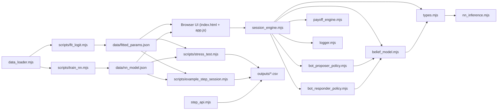
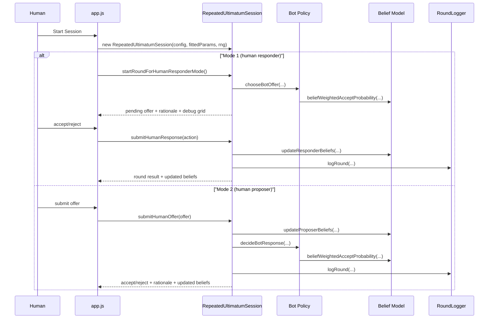
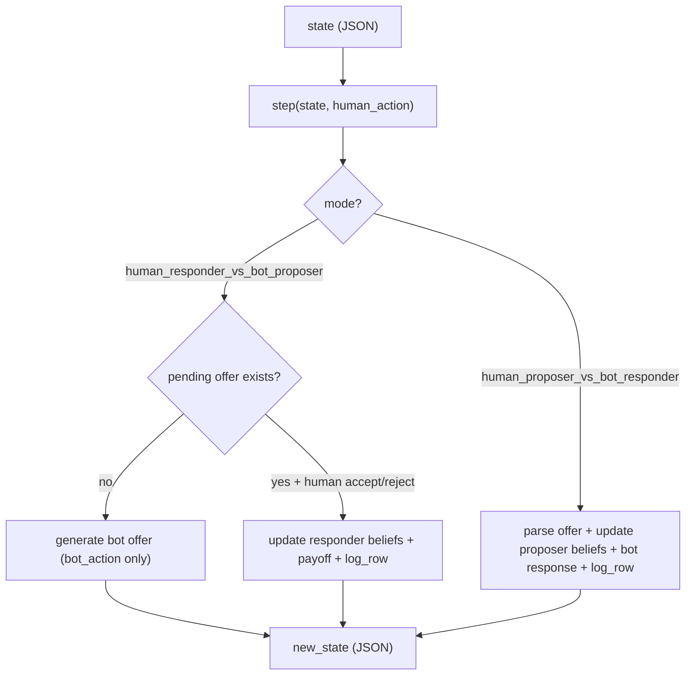

# Technical Documentation

This document explains how every major file and function in this project works, how modules interact, and how to extend or port the logic (for example, to oTree).

## 1) Project Summary

The project implements a repeated Ultimatum Game with two modes:

- Mode 1: human responder vs bot proposer
- Mode 2: human proposer vs bot responder

Core design goals implemented:

- Adaptive Bayesian belief updates over latent types
- Explainable, belief-based default policy
- Optional NN-based responder likelihood (`policy_mode="nn"`) without disabling adaptation
- Round-by-round rationale and belief logging
- Browser UI + deterministic headless stress testing
- Pure serializable `step(state, human_action)` API for oTree-style integration

---

## 2) Repository Map

| Path | Purpose |
|---|---|
| `index.html` | UI structure for setup, decisions, debug, and results |
| `styles.css` | UI styling and responsive layout |
| `app.js` | UI controller (DOM only), connects UI to `RepeatedUltimatumSession` |
| `src/utils.mjs` | Shared math/sampling/format helpers |
| `src/types.mjs` | Type taxonomy and behavioral likelihood models |
| `src/nn_inference.mjs` | Tiny MLP inference for `P(reject)` |
| `src/data_loader.mjs` | CSV parsing and feature extraction utilities |
| `src/belief_model.mjs` | Bayesian belief update and belief-weighted probability functions |
| `src/bot_proposer_policy.mjs` | Bot proposer optimization over offer grid |
| `src/bot_responder_policy.mjs` | Bot responder acceptance/rejection policy |
| `src/payoff_engine.mjs` | Payoff resolution logic |
| `src/logger.mjs` | Round log schema + CSV serialization |
| `src/sim_agents.mjs` | Synthetic human agents for stress testing |
| `src/session_engine.mjs` | Stateful game engine used by browser app |
| `src/step_api.mjs` | Pure JSON serializable stepping API (`step`) |
| `scripts/fit_logit.mjs` | Fits baseline logit reject model and priors |
| `scripts/train_nn.mjs` | Trains tiny MLP and saves weights |
| `scripts/stress_test.mjs` | Reproducible headless stress simulations |
| `scripts/example_step_session.mjs` | Demonstrates full session with `step()` API |
| `data/20100982_DATA.csv` | Input dataset |
| `data/fitted_params.json` | Generated logit coefficients + inferred priors |
| `data/nn_model.json` | Generated NN weights and normalization |
| `outputs/*.csv` | Generated run outputs |

---

## 3) Architecture Diagrams

### 3.1 High-level architecture



### 3.2 Browser round flow



### 3.3 `step()` flow for oTree integration



---

## 4) Data Contracts

### 4.1 Round log row schema

Every completed round produces this schema:

```json
{
  "round": 1,
  "mode": "human_responder_vs_bot_proposer",
  "stake": 200,
  "wealth": 1,
  "offer_amount": 70,
  "offer_share": 0.35,
  "accept_reject": "accept",
  "bot_action": "offer_70",
  "bot_beliefs": "{\"money_maximizer\":0.35,...}",
  "inferred_type": "money_maximizer",
  "decision_rationale": "Belief ...",
  "expected_accept_prob": 0.80,
  "expected_value": 104.7,
  "cumulative_payoffs": "{\"human\":70,\"bot\":130}"
}
```

### 4.2 `step_api` state schema (serializable JSON)

Top-level shape:

```json
{
  "schema_version": "ultimatum_step_state_v1",
  "config": { "...": "mode, policyMode, rounds, stake, wealth, params..." },
  "fitted_params": { "...": "logit coefficients, priors, optional nnModel" },
  "round_index": 1,
  "complete": false,
  "cumulative_payoffs": { "human": 0, "bot": 0 },
  "anchors": { "human_responder": {}, "human_proposer": {} },
  "beliefs": { "human_responder": {}, "human_proposer": {}, "bot_responder": {} },
  "pending_offer": null,
  "logs": [],
  "last_debug": { "...": "current inferred type/beliefs/grid" },
  "rng_seed": 20260218
}
```

---

## 5) File-by-File Deep Dive

### 5.1 UI files

#### `index.html`
- Declares all controls and output sections.
- Important IDs:
  - Setup: `modeSelect`, `roundsInput`, `stakeSelect`, `wealthSelect`, `offerUnitSelect`, `policyModeSelect`
  - Decision controls: `acceptBtn`, `rejectBtn`, `offerInput`, `submitOfferBtn`
  - Debug: `debugBeliefs`, `debugInferredType`, `debugExpectedAccept`, `debugGridBody`
  - Results: `resultsBody`, `downloadCsvBtn`

#### `styles.css`
- Centralized palette via CSS variables.
- `.hidden` controls panel visibility.
- `.debug-json` styles read-only belief JSON.
- Responsive adjustments below 700px.

#### `app.js`
- Pure UI orchestrator:
  - Loads fitted params and NN model (`loadFittedParams`, `loadNnModel`).
  - Creates `RepeatedUltimatumSession` on start.
  - For mode 1: asks engine for pending offer, then submits accept/reject.
  - For mode 2: parses user offer and submits to engine.
  - Updates debug panel from engine `getDebugState`.
  - Exports round logs with `session.toCsv()`.

### 5.2 Core logic files (`src/`)

#### `utils.mjs`
Math, normalization, sampling, formatting.

#### `types.mjs`
Defines latent types and model primitives:
- Baseline reject probability from logit coefficients.
- Optional NN probability override in `policyMode="nn"`.
- Type-specific responder acceptance logic.
- Type-specific proposer target share + likelihood for observed offers.

#### `nn_inference.mjs`
Runs MLP forward pass:
- Input: `[offer_share, log(stake), wealth]`
- Normalize with stored means/std
- Hidden tanh layer -> sigmoid output = `P(reject)`

#### `data_loader.mjs`
Parses raw CSV, normalizes rows, and supplies:
- calibration subset for logit
- broader subset for NN training
- offer conversion helpers between amount/share

#### `belief_model.mjs`
Bayesian update engine:
- `posterior ~ prior * likelihood`
- `learningRate` for partial updates
- `pullback` toward prior anchor to prevent collapse

#### `bot_proposer_policy.mjs`
Evaluates offer grid and chooses offer by:
- tremble randomization
- epsilon exploration
- softmax over expected values

#### `bot_responder_policy.mjs`
Builds accept probability from:
- belief-weighted responder model output
- proposer-type reputation adjustment
- temperature sampling and tremble flip

#### `payoff_engine.mjs`
Maps accept/reject and mode to round and cumulative payoffs.

#### `logger.mjs`
Keeps canonical round records and CSV export format.

#### `sim_agents.mjs`
Synthetic human behavior generation for simulations.

#### `session_engine.mjs`
Stateful browser/session runtime class:
- Keeps mutable session state (round index, beliefs, pending offers, logs).
- Handles two modes with explicit methods.
- Produces human-readable rationale and debug payload.

#### `step_api.mjs`
Pure-function serializable API:
- `createInitialState`
- `step(state, human_action)`
- `stateLogsToCsv`

No DOM, no class instance state required externally.

### 5.3 Scripts (`scripts/`)

#### `fit_logit.mjs`
- Trains logistic model on filtered dataset rows.
- Outputs coefficients + inferred priors + fit metrics.

#### `train_nn.mjs`
- Trains tiny MLP using full JS backprop + Adam.
- Saves architecture, normalization, and weights.

#### `stress_test.mjs`
- Runs large deterministic Monte Carlo sessions.
- Supports both `policyMode=belief` and `policyMode=nn`.
- Writes per-session and grouped summary CSVs.

#### `example_step_session.mjs`
- Demonstrates complete sessions with `step()` only.
- Mode 1 uses two-step per round; mode 2 uses one-step per round.

---

## 6) API Reference (Per Function / Method)

### 6.1 `src/utils.mjs`

| Function | Signature | Returns | Notes |
|---|---|---|---|
| `clamp` | `(value, min, max)` | number | Bounds value in range |
| `sigmoid` | `(x)` | number | Numerically stable logistic |
| `softmax` | `(values, temperature=1)` | number[] | Stable softmax with fallback uniform |
| `sampleCategorical` | `(probabilities, rng=Math.random)` | index number | Categorical sampling |
| `roundTo` | `(value, decimals=4)` | number | Decimal rounding |
| `roundCurrency` | `(value)` | integer | Currency rounding |
| `formatShare` | `(share)` | string | Percent string |
| `normalizeBeliefMap` | `(beliefs)` | object | Positive normalize to sum 1 |
| `argmaxBelief` | `(beliefs)` | `{type, probability}` | Max belief type |
| `mulberry32` | `(seed)` | `rng()` function | Seeded deterministic RNG |
| `gaussianPdf` | `(x, mean, sigma)` | number | Normal density |

### 6.2 `src/types.mjs`

| Export | Type | Description |
|---|---|---|
| `TARGET_STAKES` | const number[] | Canonical stake levels |
| `RESPONDER_TYPES` | const string[] | Latent responder types |
| `PROPOSER_TYPES` | const string[] | Latent proposer types |
| `DEFAULT_FITTED_PARAMS` | const object | Fallback coefficients/priors/nnModel |
| `baselineRejectProbability` | function | Logit reject prob or NN reject prob in `nn` mode |
| `responderAcceptProbability` | function | Type-conditioned acceptance probability |
| `proposerTargetShare` | function | Type-conditioned expected offer share |
| `proposerOfferLikelihood` | function | Likelihood of observed offer under proposer type |

### 6.3 `src/nn_inference.mjs`

| Function | Signature | Returns | Notes |
|---|---|---|---|
| `buildNnFeatureVector` | `(context)` | `[offerShare, logStake, wealth]` | Feature transform |
| `predictRejectProbability` | `(nnModel, context)` | number \| null | Runs MLP forward pass |

### 6.4 `src/data_loader.mjs`

| Function | Signature | Returns | Notes |
|---|---|---|---|
| `parseCsvText` | `(text)` | raw row[] | Custom CSV parser |
| `normalizeUltimatumRows` | `(rawRows)` | normalized row[] | Standardized numeric fields |
| `calibrationRows` | `(rawRows)` | row[] | Filter for logit calibration |
| `nnTrainingRows` | `(rawRows)` | row[] | Filter for NN training |
| `rejectModelFeatures` | `(row)` | number[] | `[1, wealth, stake dummies, offer_share]` |
| `inferShareFromAmount` | `(offerAmount, stake)` | number \| null | amount -> share |
| `inferAmountFromShare` | `(offerShare, stake)` | number \| null | share -> rounded amount |

### 6.5 `src/belief_model.mjs`

| Function | Signature | Returns | Notes |
|---|---|---|---|
| `createInitialBeliefs` | `(typeNames, priors)` | belief map | Uniform or provided priors |
| `bayesUpdate` | `(priorBeliefs, likelihoodByType, options)` | posterior | Includes `learningRate` + `pullback` |
| `updateResponderBeliefs` | `({priorBeliefs, accepted, context, ...})` | `{posterior, likelihoodByType, inferred}` | Update after accept/reject |
| `updateProposerBeliefs` | `({priorBeliefs, observedOfferShare, ...})` | `{posterior, likelihoodByType, inferred}` | Update after observed offer |
| `beliefWeightedAcceptProbability` | `({responderBeliefs, context, ...})` | number | Mixture over responder types |

### 6.6 `src/bot_proposer_policy.mjs`

| Function | Signature | Returns | Notes |
|---|---|---|---|
| `buildOfferGrid` | `({minShare,maxShare,stepShare})` | number[] | Candidate share grid |
| `chooseBotOffer` | `({stake,wealth,roundIndex,responderBeliefs,...})` | decision object | EV evaluation + tremble/epsilon/softmax + rationale + debug grid |

### 6.7 `src/bot_responder_policy.mjs`

| Function | Signature | Returns | Notes |
|---|---|---|---|
| `decideBotResponse` | `({offerShare,offerAmount,stake,wealth,...})` | decision object | Accept/reject with inferred proposer-type adjustment and tremble |

### 6.8 `src/payoff_engine.mjs`

| Export | Type | Description |
|---|---|---|
| `MODES` | const object | Mode constants |
| `resolvePayoffs` | function | Computes round and cumulative payoffs |

### 6.9 `src/logger.mjs`

| Class/Method | Signature | Description |
|---|---|---|
| `RoundLogger` | `new RoundLogger()` | Holds `records` array |
| `logRound` | `(entry)` | Normalizes + appends one row |
| `toCsv` | `()` | CSV string from `records` |

### 6.10 `src/sim_agents.mjs`

| Function | Signature | Returns | Notes |
|---|---|---|---|
| `sampleHumanResponderType` | `(priors,rng)` | type string | Draw latent responder type |
| `sampleHumanProposerType` | `(priors,rng)` | type string | Draw latent proposer type |
| `humanResponderDecision` | `({responderType,context,fittedParams,rng})` | `{accepted, acceptProb}` | Simulated accept/reject |
| `humanProposerOffer` | `({proposerType,context,rng})` | share number | Simulated offer with Gaussian noise |

### 6.11 `src/session_engine.mjs` (class API)

| Method | Signature | Returns | Description |
|---|---|---|---|
| `constructor` | `(config, fittedParams, rng)` | instance | Initializes session state and priors |
| `isComplete` | `()` | boolean | Whether all rounds done |
| `getProgress` | `()` | object | Round index, total, cumulative payoffs |
| `getLogRecords` | `()` | row[] | In-memory logs |
| `getDebugState` | `()` | object | Beliefs/inferred type/grid for UI |
| `toCsv` | `()` | string | Logs to CSV |
| `startRoundForHumanResponderMode` | `()` | pending round | Generates bot offer (mode 1) |
| `submitHumanResponse` | `(accepted)` | result | Resolves mode-1 round |
| `submitHumanOffer` | `({offerAmount,offerShare,offerInputMode})` | result | Resolves mode-2 round |

### 6.12 `src/step_api.mjs` (portable logic API)

Exported API:

| Function | Signature | Returns | Description |
|---|---|---|---|
| `createInitialState` | `(config, fittedParams)` | state JSON | Creates portable serializable state |
| `step` | `(state, humanAction)` | `{new_state, bot_action, log_row}` | Single step transition |
| `stateLogsToCsv` | `(stateOrRows)` | string | CSV from logs |

Key internal helpers in this module:
- normalization/parsing: `normalizeConfig`, `normalizeFittedParams`, `parseAcceptReject`, `parseHumanOffer`
- mode 1: `mode1GeneratePending`, `mode1OfferBotAction`, `mode1ResolveRound`
- mode 2: `mode2ResolveRound`
- deterministic RNG from state: `makeRngFromSeed`

### 6.13 `scripts/fit_logit.mjs`

| Function | Description |
|---|---|
| `parseArgs` | CLI arg parser |
| `fitLogisticRegression` | Fits logit with adaptive gradient scaling |
| `modelMetrics` | Computes log-likelihood and McFadden R2 |
| `inferResponderPriors` | Type prior estimation from responder behavior likelihoods |
| `inferProposerPriors` | Type prior estimation from proposer offer likelihoods |
| `main` | Script orchestration and JSON output |

### 6.14 `scripts/train_nn.mjs`

| Function | Description |
|---|---|
| `computeNormalization` / `normalizeX` | Feature standardization |
| `forwardSample` | MLP forward pass |
| `evaluate` | Loss + accuracy |
| `trainMlp` | Backprop + Adam training loop |
| `main` | Script orchestration and JSON output |

### 6.15 `scripts/stress_test.mjs`

| Function | Description |
|---|---|
| `aggregateBy` | Group metrics mean/sd |
| `parseWealthArg` / `parseStakesArg` | CLI range parsing |
| `runStressTest` | Full deterministic batch simulation and CSV outputs |

### 6.16 `scripts/example_step_session.mjs`

| Function | Description |
|---|---|
| `pickHumanActionForMode1` | Demo responder decision heuristic |
| `pickHumanActionForMode2` | Demo proposer share cycle |
| `main` | End-to-end `step()` session runner |

---

## 7) How To Extend Safely

### Add a new latent type
1. Add name to `RESPONDER_TYPES` and/or `PROPOSER_TYPES` in `src/types.mjs`.
2. Implement behavior:
   - responder path in `responderAcceptProbability`
   - proposer path in `proposerTargetShare` and `proposerOfferLikelihood`
3. Ensure priors include the new key (`fit_logit` output or defaults).
4. No changes needed in Bayesian update loops; they iterate over type arrays.

### Change offer action space
1. Adjust grid in `buildOfferGrid` defaults in `src/bot_proposer_policy.mjs`.
2. Optionally pass custom `offerGrid` through session config.
3. Debug panel and logs already consume whatever grid is produced.

### Swap/upgrade NN architecture
1. Update trainer output schema in `scripts/train_nn.mjs`.
2. Keep `data/nn_model.json` contract synchronized.
3. Update forward pass in `src/nn_inference.mjs`.
4. Keep `baselineRejectProbability(..., {policyMode: "nn"})` contract unchanged.

### oTree integration
Use only:
- `createInitialState(...)`
- repeated calls to `step(state, action)`
- persist `new_state` JSON each round.

For mode 1 in oTree:
1. Server call `step(state, null)` to get bot offer.
2. Show offer to participant.
3. Submit participant accept/reject.
4. Server call `step(state_with_pending_offer, {decision: ...})`.

---

## 8) Known Implementation Characteristics

- Determinism:
  - Browser mode uses `Math.random` by default.
  - Stress tests and `step_api` can be deterministic using seed.
- Belief collapse prevention:
  - `beliefLearningRate` and `beliefPullback` are active in updates.
- Noise model:
  - Explicit tremble is implemented in bot proposer and responder policies.
- Explainability:
  - Every round stores a rationale string and belief JSON in logs.

